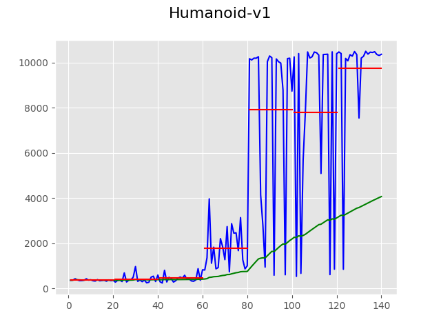

# <span style="color:#2595bc"> Imitation Learning </span>
This week's assignmment deals with <a href="https://blog.statsbot.co/introduction-to-imitation-learning-32334c3b1e7a">Imitation Learning</a>. This includes implementation of Direct Behavorial Cloning and  <a href="http://rll.berkeley.edu/deeprlcourse-fa15/docs/2015.10.5.dagger.pdf">DAgger Algorithm</a>

## Code
The folder <b>experts</b> contains trained expert policy.network. Our objective is to clone these expert policies.

<b>run_expert.py</b> lets you run an expert policy and save the rollout data.
```shell
python3 run_expert.py experts/Humanoid-v1.pkl Humanoid-v1 --render \
            --num_rollouts 20
```
<b>get_rollouts.bash</b> script generates the rollout data for all environments and rollout numbers at once.


<b>cloning.py</b> lets you clone the obtained rollout data using simple Neural Network.
```shell
python3 cloning.py experts/Humanoid-v1.pkl Humanoid-v1 --render \
            --num_rollouts 20
```
<b>Dagger.py</b> Runs the DAgger algorithm.
```shell
python3 Dagger.py experts/Humanoid-v1.pkl Humanoid-v1 --render \
            --num_rollouts 20
```
# <span style="color:#2595bc"> Results </span>

Simple, cloning aren't able to give good performance/rewards, wheras DAgger algorithm
eventually reached the performance of expert policy. The below graph shows the rewards received
as for subsequent models we get from DAgger. Clearly, the performance improves over time.



Gif of the agent obtained from DAgger.